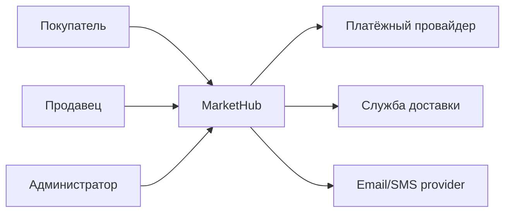
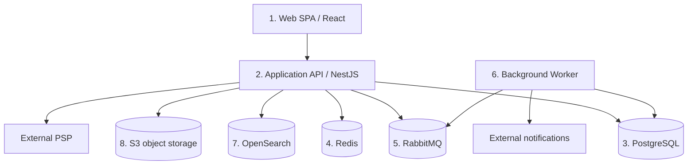
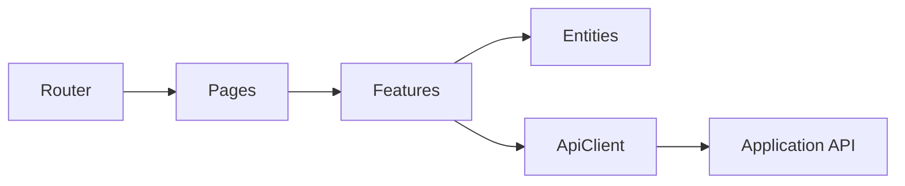
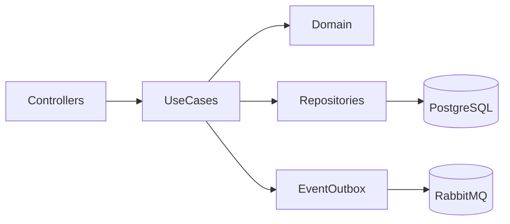
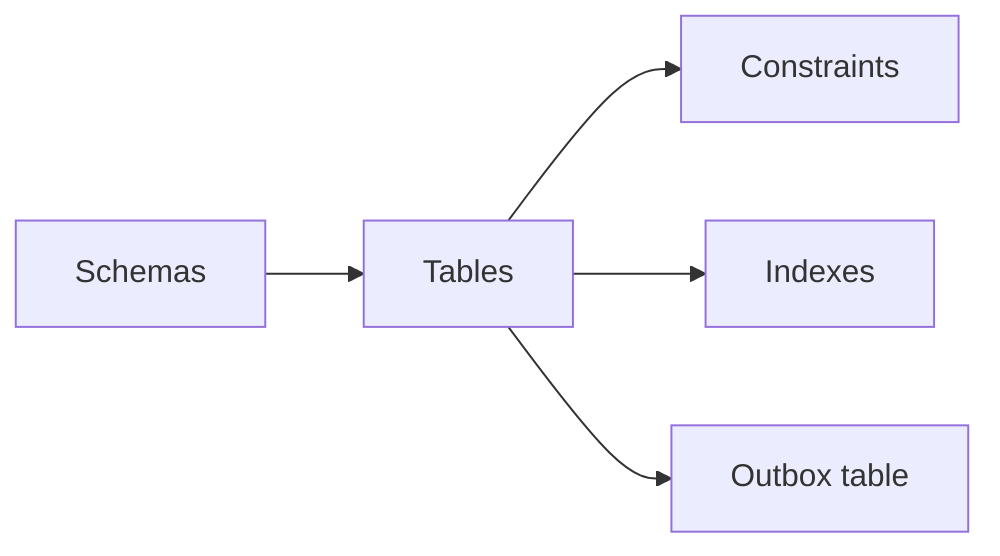
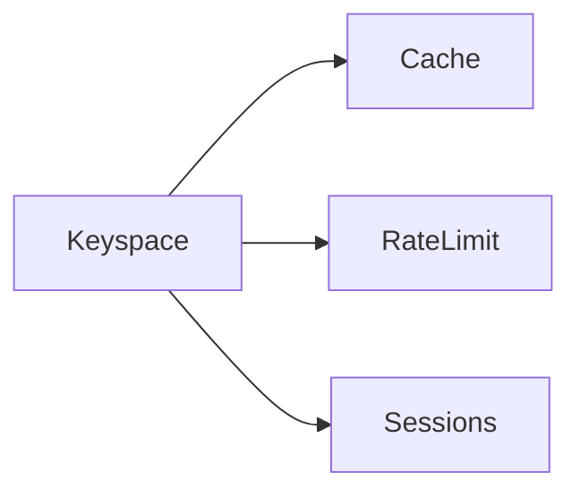
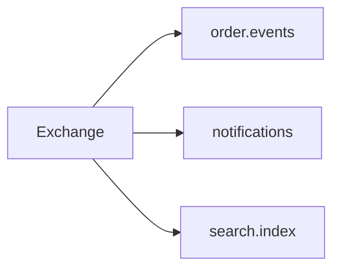
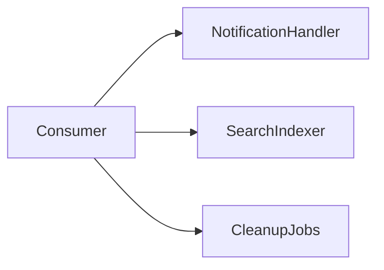
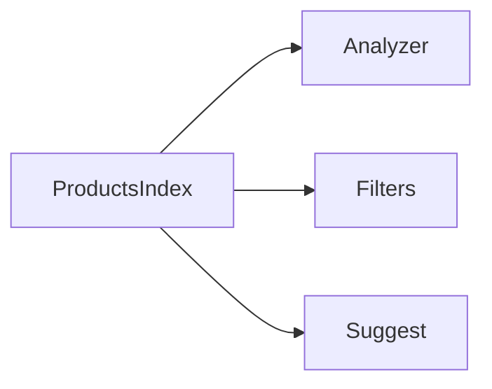
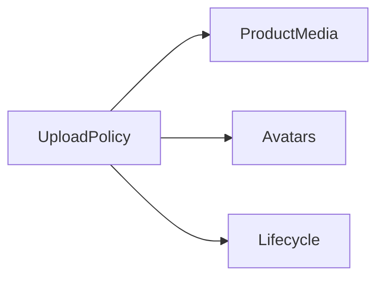

# ДЗ 2 — Обзор архитектурных стилей ИС

Для MarketHub выбран **модульный монолит + отдельные инфраструктурные контейнеры**. Такой старт сохраняет транзакционную целостность core-домена и не вводит раннюю распределённую сложность. При росте Search, Notifications, Media и Payments могут быть извлечены в отдельные сервисы.

## C4 Context

## C4 Containers
На диаграмме больше пяти контейнеров, как требует критерий задания.

## Components: Web SPA

Компоненты: Router, Pages, Feature modules, Entity model, API client.

## Components: Application API

## Components: PostgreSQL

## Components: Redis

## Components: RabbitMQ

## Components: Background Worker

## Components: OpenSearch

## Components: S3

## Взаимодействия и обоснование
Синхронные пользовательские команды идут Web → API. Транзакционные данные записываются в PostgreSQL; доменные события сначала фиксируются в transactional outbox, затем отправляются в RabbitMQ. Worker обрабатывает уведомления и поисковую индексацию. Redis — ускоритель и не является единственным источником критичных данных. OpenSearch — производная поисковая модель с eventual consistency. S3 хранит бинарные объекты, PostgreSQL — их метаданные и права владения.

Минусы выбранного стиля: API и shared DB поначалу масштабируются крупнее целиком. Компенсации: строгие module boundaries, read replicas, query/index tuning и заранее определённые seams для извлечения сервисов только по фактической нагрузке или организационным границам.
