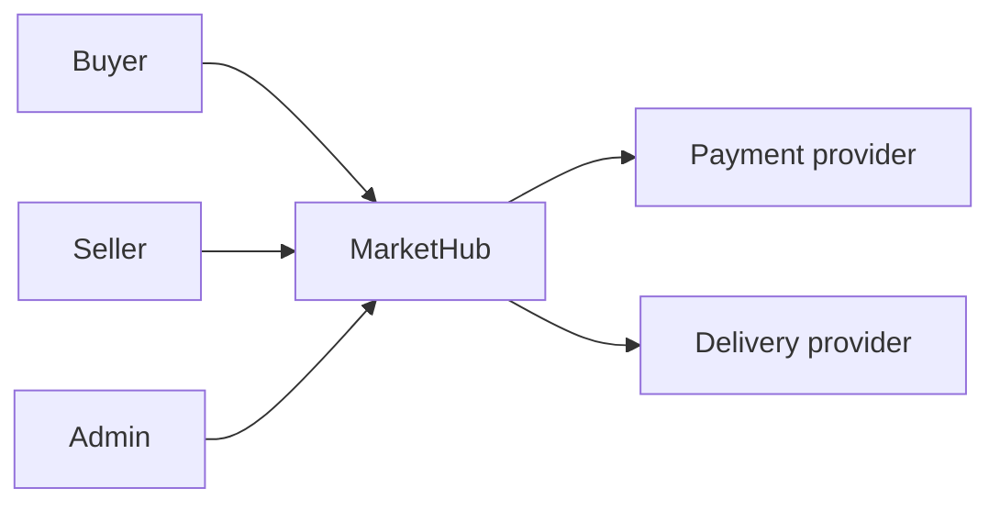
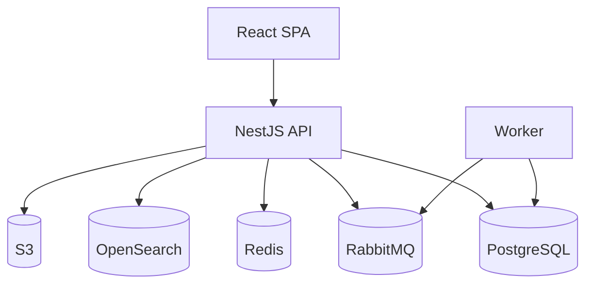
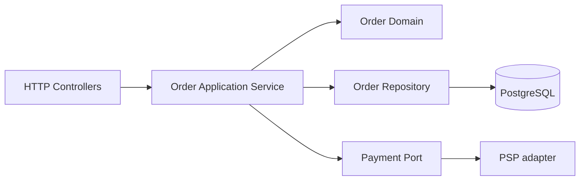
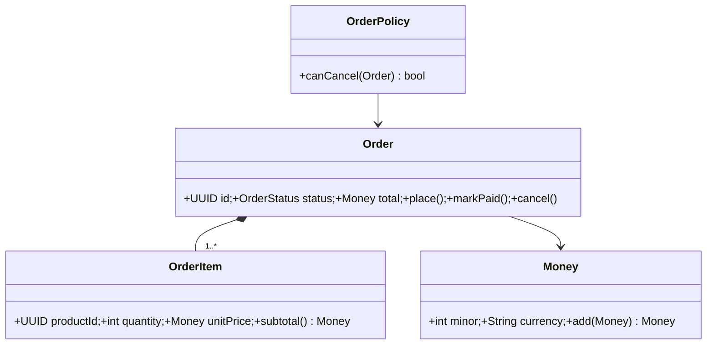
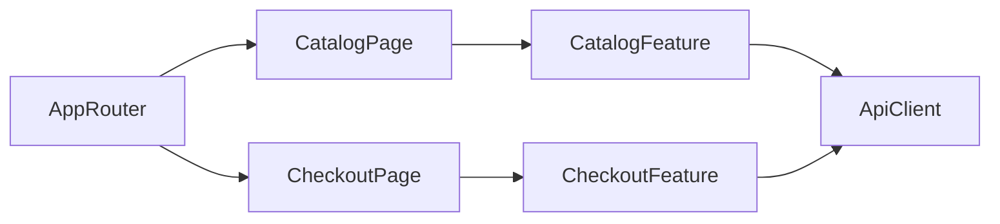
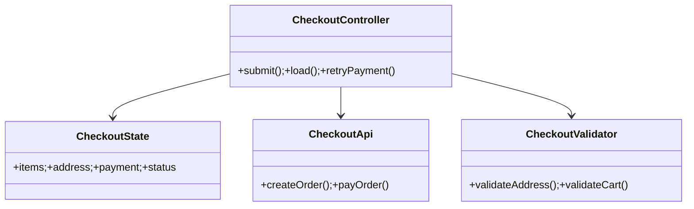
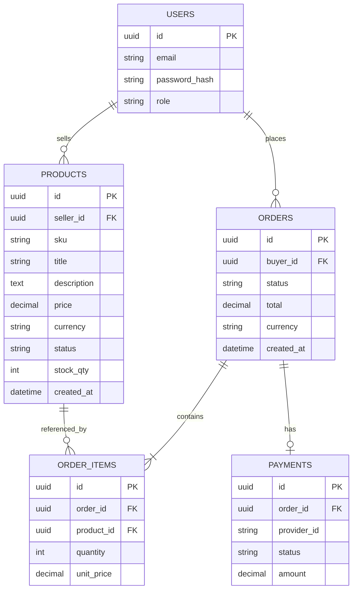

# ДЗ 3 — Языки проектирования ИС

## C4 Context

## C4 Containers

## Контейнер 1: Application API → components

### UML classes: Order Domain

## Контейнер 2: Web SPA → components

### UML classes: Checkout Feature

## ER

