# Итоговый проект — архитектура MarketHub

## Предметная область
Marketplace цифровых товаров и услуг. Пользователи регистрируются, просматривают товары, добавляют их в корзину, оформляют/оплачивают заказы и могут размещать собственные предложения. Архитектура учитывает рост транзакций, безопасность, fraud-controls, payment/delivery integrations и наблюдаемость.

## C4 Context
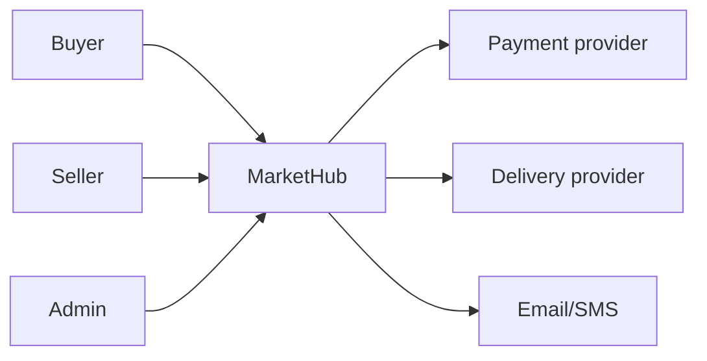
## C4 Containers
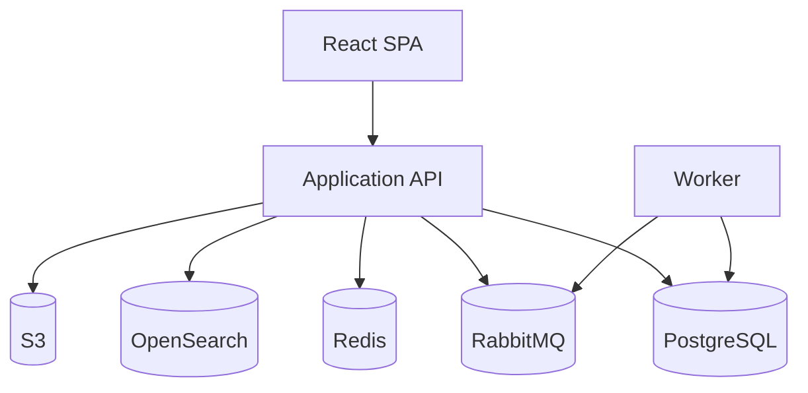
## C4 Components
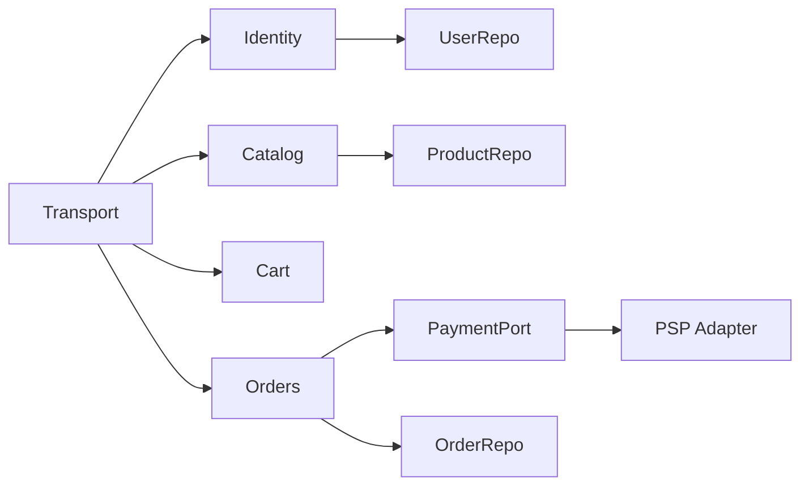

## ER
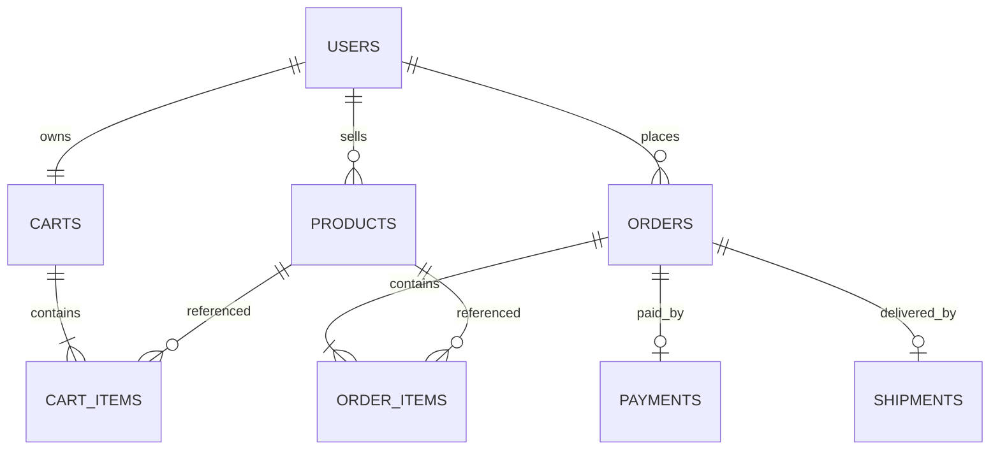

# UML тип 1 — Sequence (3)
## Sequence 1: Checkout
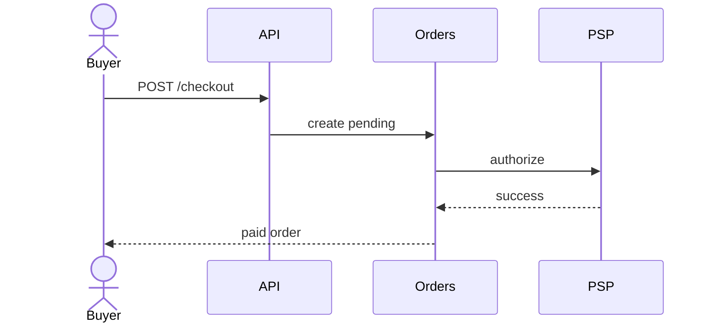
## Sequence 2: Product publish
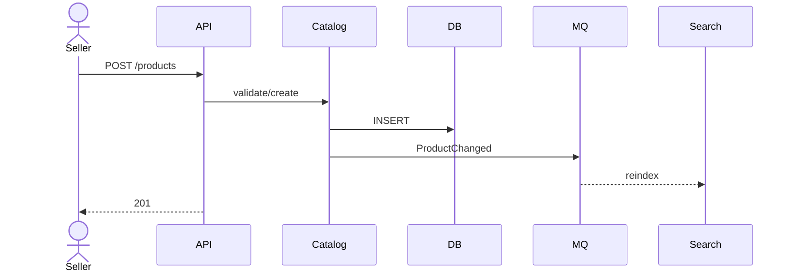
## Sequence 3: Refund
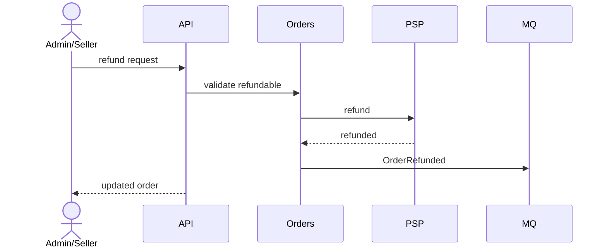

# UML тип 2 — State (3)
## State 1: Order
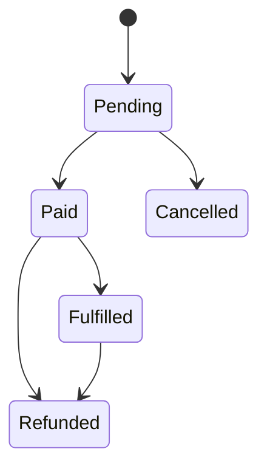
## State 2: Product
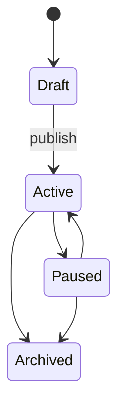
## State 3: Payment
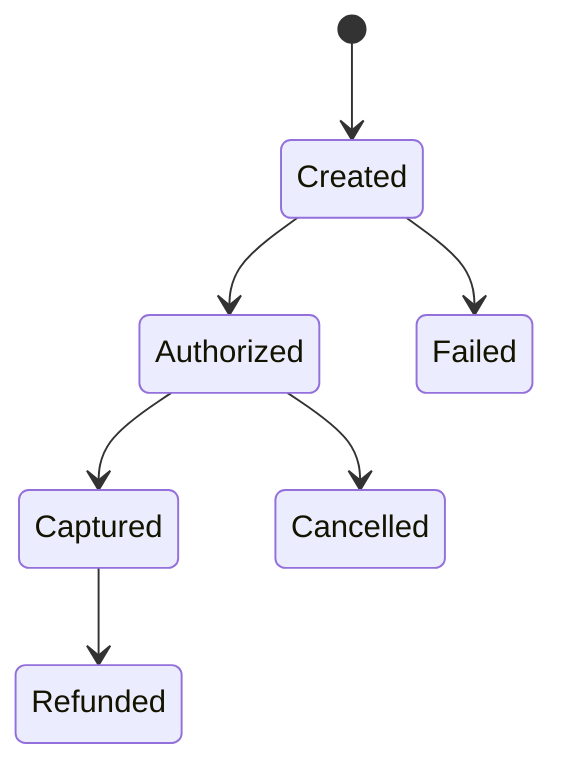

# UML тип 3 — Class (3)
## Class 1: Catalog
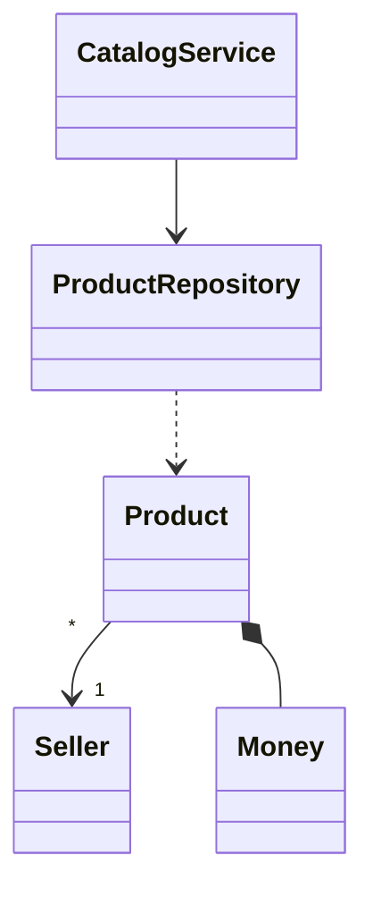
## Class 2: Orders
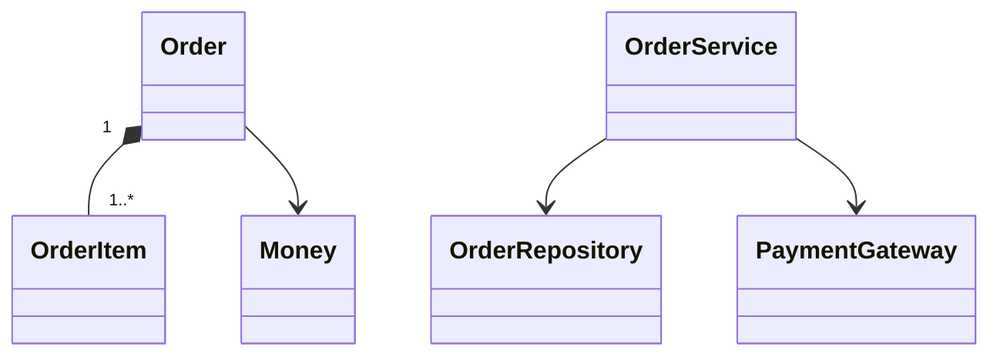
## Class 3: Identity
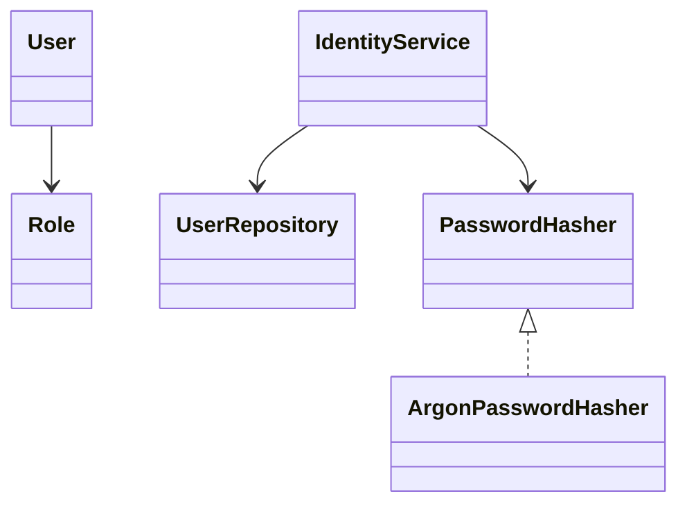

## Анализ схем и узких мест
- **PostgreSQL** — возможная write bottleneck. Сначала query/index tuning и read replicas; затем partitioning/извлечение bounded contexts при подтверждённой необходимости.
- **Search** — derived model, допустима eventual consistency; нужен reindex workflow.
- **Payments** — idempotency keys, webhook signature validation, reconciliation job.
- **RabbitMQ/Worker** — DLQ, retry policy, метрики backlog.
- **Security/fraud** — RBAC, rate limits, audit log, PSP antifraud signals, moderation hooks.
- **Media** — S3+CDN снимают binary load с API.

Плюс modular monolith — низкая operational complexity и сильная consistency. Минус — central deployment/shared DB. Microservice extraction выполняется только при фактической нагрузке, отдельном жизненном цикле или ownership boundary.
