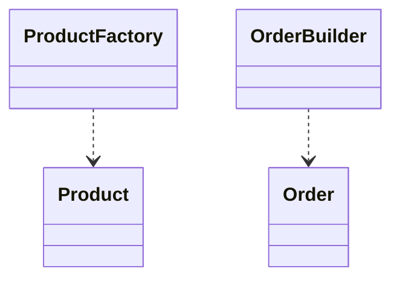
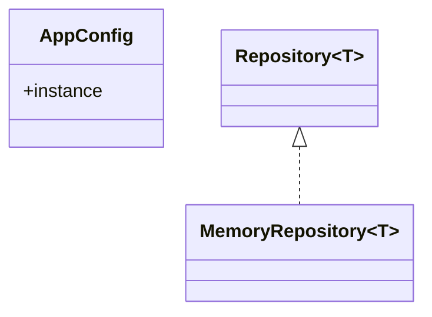
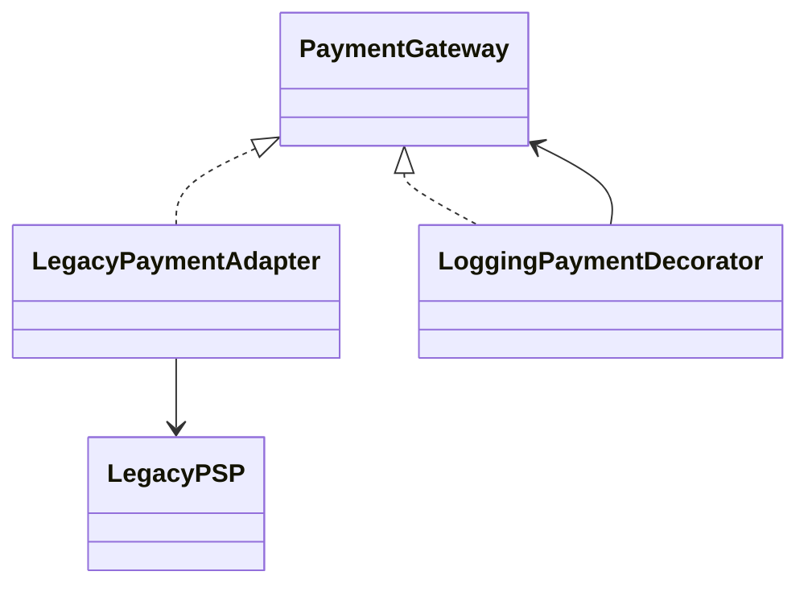
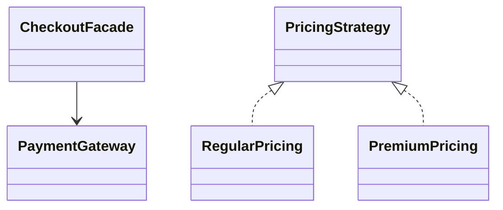
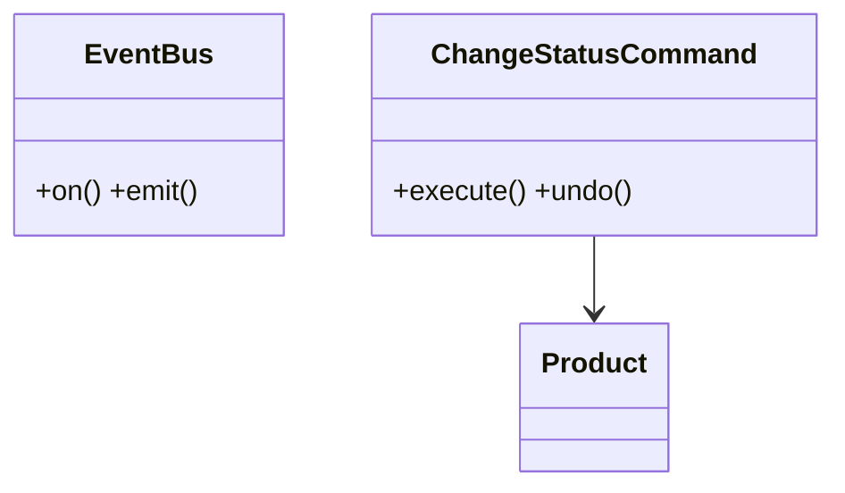
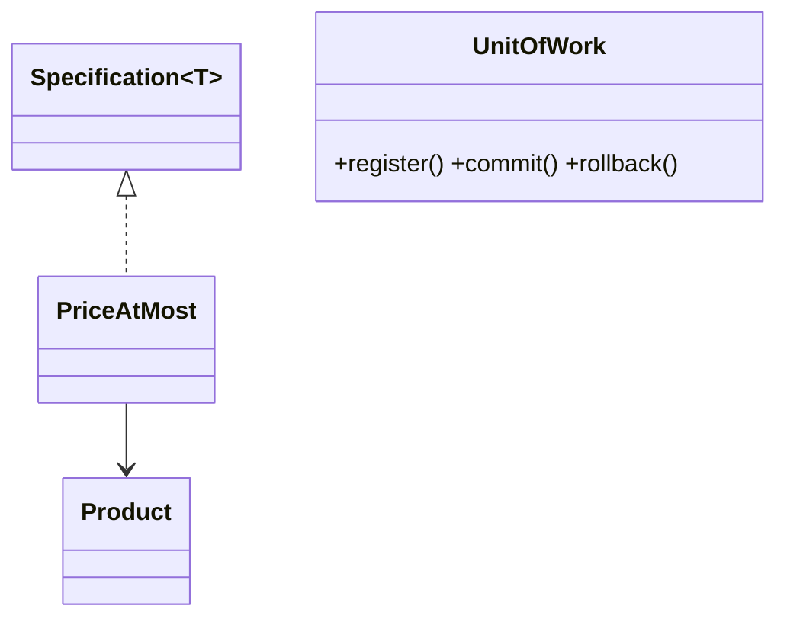

# UML для 12 шаблонов

## 1 — Factory + Builder

## 2 — Singleton + Repository

## 3 — Adapter + Decorator

## 4 — Facade + Strategy

## 5 — Observer + Command

## 6 — Specification + UnitOfWork

